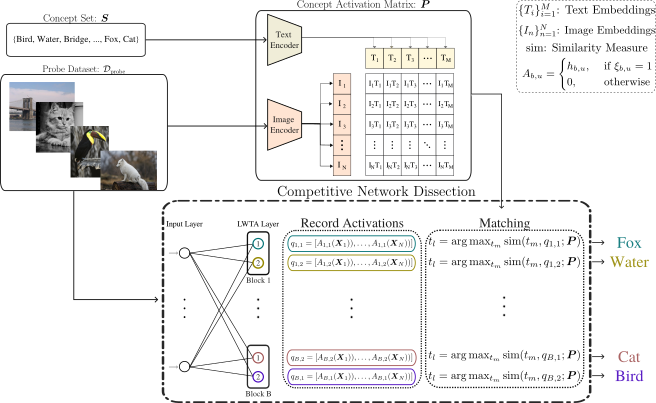

## DISCOVER

This is the official repository for our paper: [DISCOVER: Making Vision Networks Interpretable via Competition and Dissection](https://arxiv.org/) published at NeurIPS 2023. 



# Usage

First create and install the necessary python packages using the provided environment .yaml files for the corresponding architectures. 

```
conda env create -f environment.yml
```

# Getting Ready

Navigate to the respective folder of the architecture that you want to train or evaluate and use the following commands for training or evaluation.

# DeiT Scripts

## checkpoint 

Here, we provide the checkpoint for the DeiT-T/8 model via a Google Drive link.

(https://drive.google.com/drive/folders/1TTriY91DcNVQnU-xkroV2QoKv9UMbpMB)

## Changes to original implementations

As mentioned in the Supplementary Material, implementing CVNs is a straightforward procedure. Specifically, in the context of DeiT models, we made some minor modifications in the timm library that defines the base Vision Transformer model. These changes can be found in the timm/models/layers/activations.py file. There, we added the Stochastic LWTA activation using the gumbel softmax trick as described in the main text. Then, there exists another minor change in the timm/models/vision_transformer model. Specifically, we used the existing "act_layer" argument to pass our LWTA module, and introduced some additional arguments to be passed to the LWTA layer, such as number of competitors, e.t.c. This module is called when using the create_model function of timm that is used in both eval_model.py and train_model.py.

## Data preparation

We use the same data preparation for image net as DeiT and ResNet ImageNet. 

Download and extract ImageNet train and val images from http://image-net.org/.
The directory structure is the standard layout for the torchvision [`datasets.ImageFolder`](https://pytorch.org/docs/stable/torchvision/datasets.html#imagefolder), and the training and validation data is expected to be in the `train/` folder and `val` folder respectively:

```
/path/to/imagenet/
  train/
    class1/
      img1.jpeg
    class2/
      img2.jpeg
  val/
    class1/
      img3.jpeg
    class2/
      img4.jpeg
```

## Evaluation
To evaluate a pre-trained DeiT-tiny on ImageNet val with a single GPU run:

```
python eval_model.py --eval --resume ablation/model_name/best_checkpoint.pth --model deit_tiny_patch16_224 --data-path /path/to/imagenet
```

For example. when considering the DeiT-T/8 model, replace "model_name" above with "deit-tiny-8" and this should yield:

```
* Acc@1 77.000 Acc@5 93.968 loss 0.881
```

And for Deit-small and assuming the model DeiT-Small/12:

```
python eval_model.py --eval --resume ablation/model_name/best_checkpoint.pth --model deit_small_patch16_224 --data-path /path/to/imagenet
```

which should give

```
* Acc@1 72.500 Acc@5 91.124 loss 1.219
```

For this to work, you also need to modify the considered model in the eval_model.py in line 186. Now it is set to DeiT-T/2. 
Don't forget the aforementioned note on the path of the considered checkpoint.

## Training
To train DeiT-small and Deit-tiny on ImageNet on a single node with 1 gpu for 300 epochs run:

DeiT-small

```
python train_model.py --model deit_small_patch16_224 --batch-size 256 --data-path /path/to/imagenet --output_dir /path/to/save
```

DeiT-tiny

```
python train_model.py --model deit_tiny_patch16_224 --batch-size 256 --data-path /path/to/imagenet --output_dir /path/to/save
```

The current code is set to train the DeiT-T/2 model. You can change the model to train in the train_model file in line 186.


# ResNet Scripts

For ResNet-18 trained on Places365, the structure of the files is simpler. Specifically, we have four different files: (i) resnet.py, (ii) activations.py, (iii) main_resnet.py and (iv) main_resnet_eval.py. 
The first file contains the structure of the conventional resnet architecture, where all relu activations are replaced by the LWTA activaiton defined in the activation.py file. We can then define the CVN version of the ResNet models to train and evaluate multiple models.


## Evaluation
To evaluate a pre-trained ResNet-18 model on Places 365 with a single GPU run:
```
python main_resnet_eval.py -a resnet18 -b 256 -j 8 --dataset places365 /path/to/places365
```

If the dataset is not already in the provided path, you need to set the corresponding flag "Download=True" in the main_resnet_eval.py file. 
The script assumes that the checkpoints are in the path "ablation/model_name/best_checkpoint.pth". For example, when considering resnet-18-places-8, the checkpoint should be in "ablation/resnet-18-places-8/" path.
The current path for the datasets is set on lines 110-114, so you can modify that to set the correct path. 

On lines 94-95, you can set which models you want to evaluate (given that the checkpoints are in the corresponding folders)


## Training
To train a ResNet-18 model on a single node with 1 gpu for 90 epochs run:

```
python main_resnet.py -a resnet18 -b 256 -j 8 --dataset places365 path/to/places365  
```

Again, you can change which models to train, by changing the number of considered competitors in line 94. If you run the script as is, it will train the CVN ResNet model with 2,4 and 8 competitors.

# DISSECTION

For dissecting our CVNs, we turn to the CLIP-Dissect model. All the accompanied code comes from the official repository, with some minor changes to implement the considered models and the proposed Jensen Shannon divergence measure. As the authors suggest, we changed the data_utils file to load our own models including both DeiT and ResNet. There the model expects the checkpoint for the model in consideration to be in the same folder as in the evaluation steps before, i.e. ablation/model_name/best_checkpoint.py. The proposed Jensen Shannon implementation can be found in the similarity.py file. To provide a working example, without overwhelming the user, we provide the jupyter notebook script that was used to produce Table 2 in the main text. There, you can change the corresponding parameters in order to provide the similarity metric for a given layer of the considered model, using the similarity function of your choice. 

## Sources:

- CLIP: https://github.com/openai/CLIP
- Text datasets(10k and 20k): https://github.com/first20hours/google-10000-english
- Text dataset(3k): https://www.ef.edu/english-resources/english-vocabulary/top-3000-words/
- Broden download script based on: https://github.com/CSAILVision/NetDissect-Lite


## Cite this work


```
@inproceedings{panousis2023discover,
  title={DISCOVER: Making Vision Networks Interpretable via Competition and Dissection},
  author={Panousis, Konstantinos P. and Chatzis, Sotirios},
  booktitle = {Advances in Neural Information Processing Systems},
  volume = {36},
  year={2023}
}
```
